# Admin docs

## table of contents

- [registration](#registration)
- [adding, deleting and editing blog posts](#adding-deleting-and-editing-blog-posts)
- [adding, deleting and editing offers](#adding-deleting-and-editing-offers)
- [completing orders](#completing-orders)
- [changing user role, deleting users](#changing-user-role-deleteing-users)

## Registration

To register a new account, press user icon in the top right corner
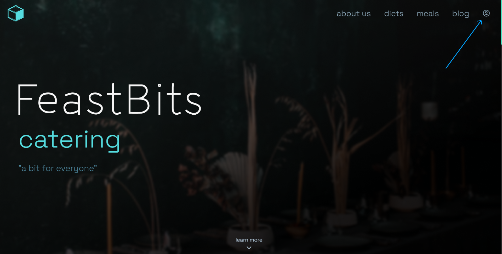

After that, click sign up button

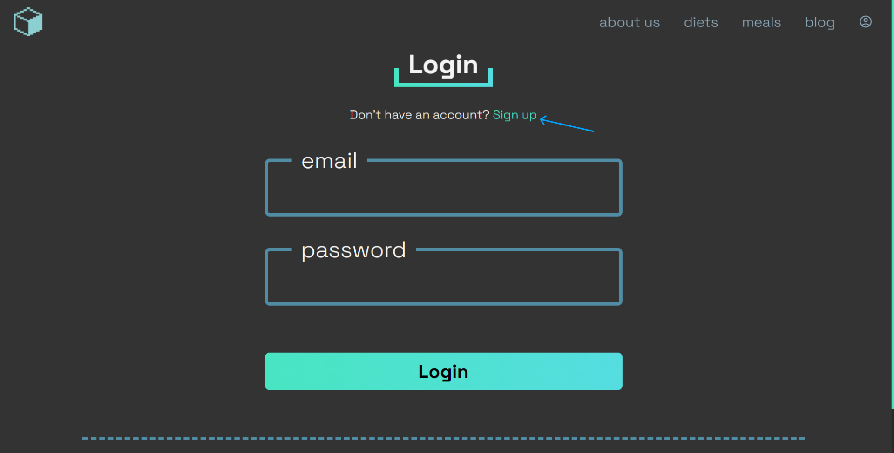

Fill in the form marked with blue box, and press sign up button

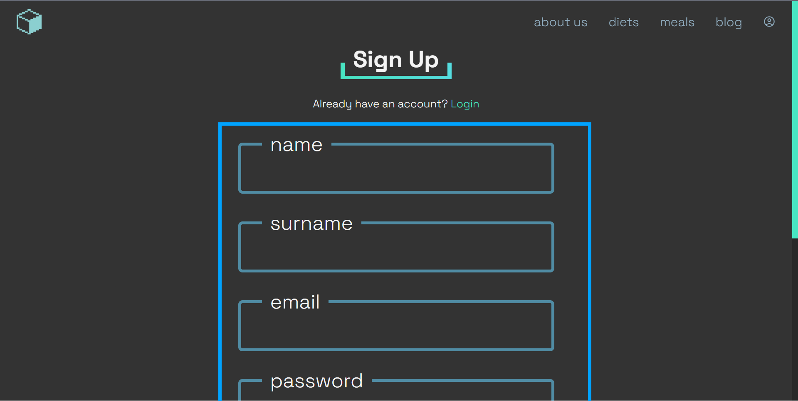

## Adding, deleting and editing blog posts

To add blog post click admin panel button in top right corner

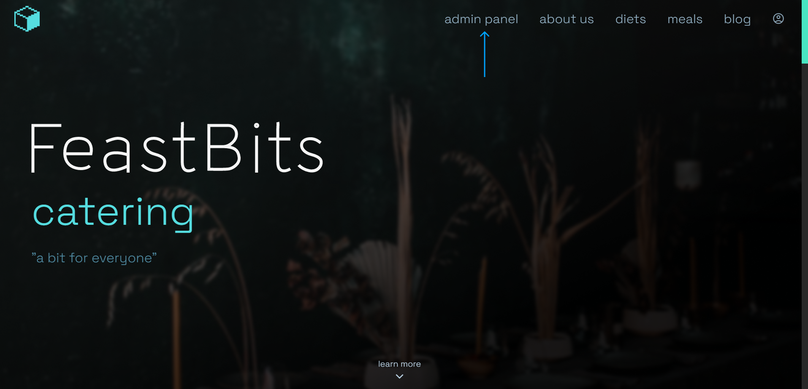

Then press `+` icon above posts list

Fill in the form, then press add button

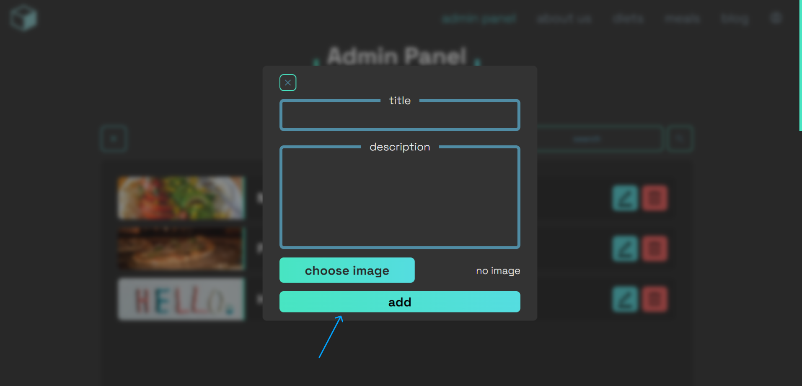

To delete a post, press delete button on the right of the post you want to delete

To edit a blog post press edit button on the right of the post you want to edit

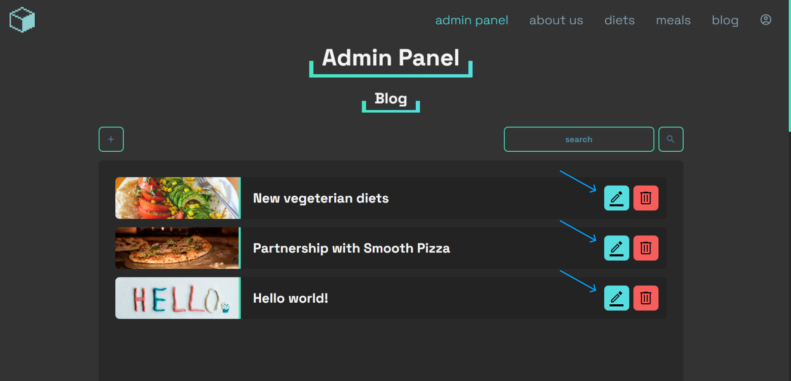

Then fill in the form and press edit button

## Adding, deleting and editing offers

To add blog post click admin panel button in top right corner

Then scroll to offer section and press `+` icon above posts list

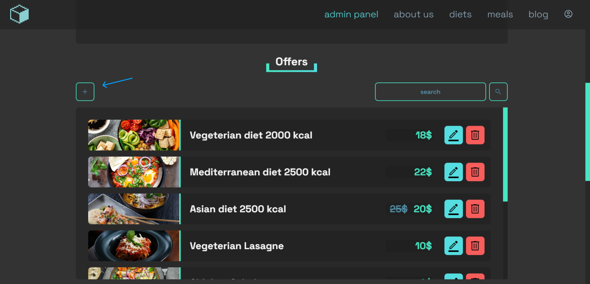

Fill in the form, then press add button

To delete a post, press delete button on the right of the post you want to delete

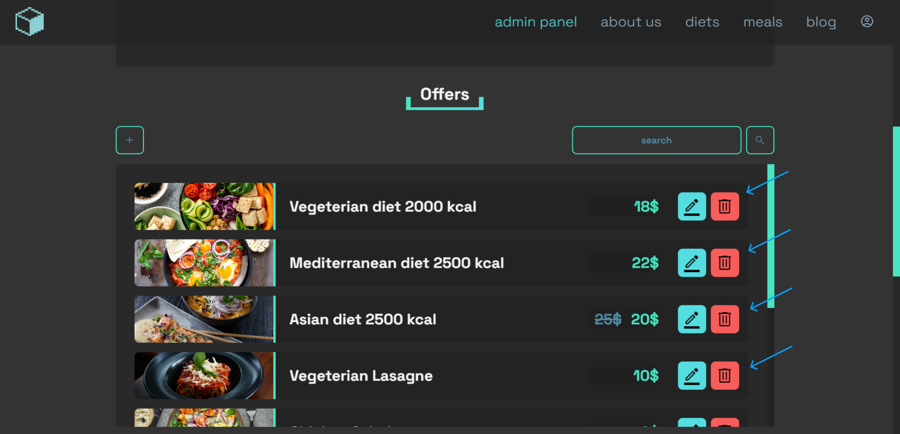

To edit a blog post press edit button on the right of the post you want to edit

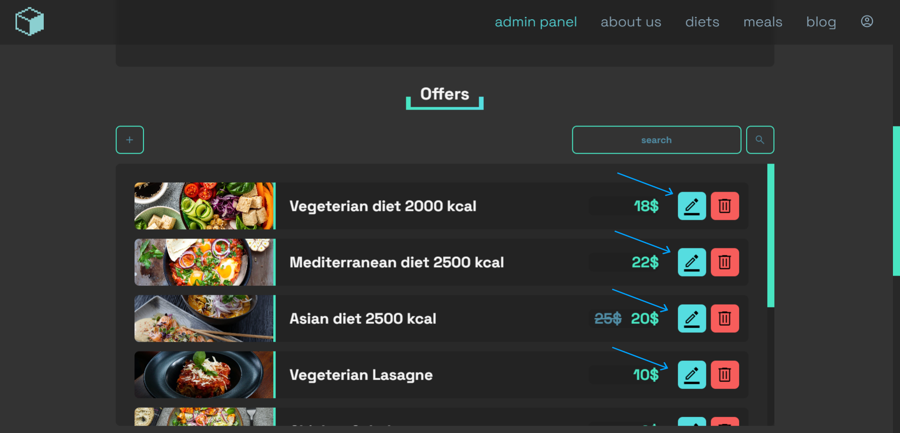

Then fill in the form and press edit button

## Completing orders

To complete order or remove it from database, first click on the admin panel button in top right corner

Scroll down to user orders section

If you want to complete an order press complete button on right side of the order

Or if you want to remove order from database, press the delete button

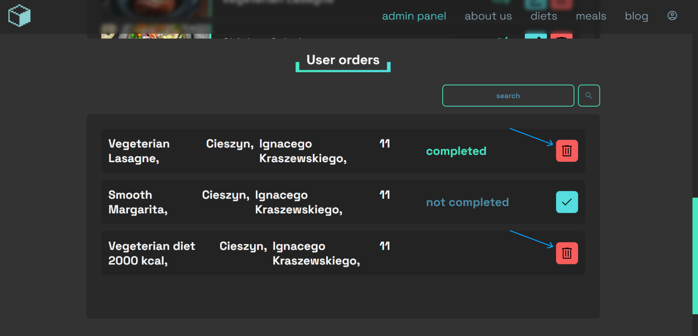

## Changing user role, deleteing users

To change user role, first click on the admin panel button in top right corner

Scroll down to Users section

To change user role, click the button on the right side of user card

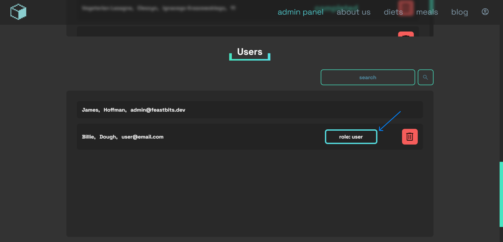
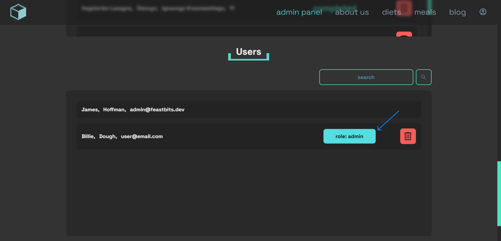

To delete user, click on the remove button on the right side of user card

