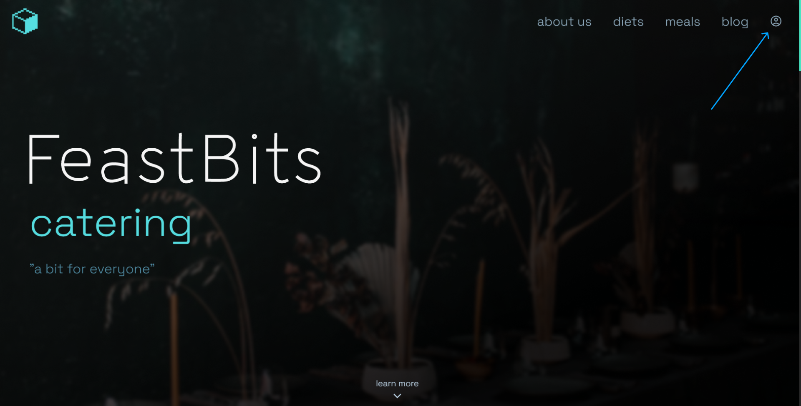
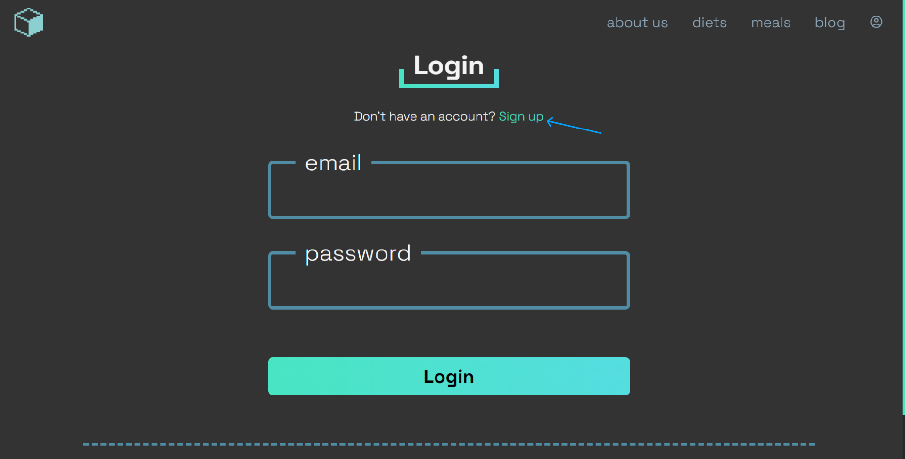
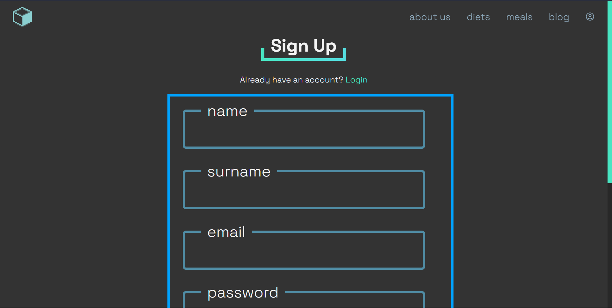

# Admin docs

## table of contents

- [registration](#registration)
- [adding and editing blog posts]()
- [adding and editing offers]()
- [completing orders]()

## Registration

To register a new account, press user icon in the top right corner

After that, click sign up button

Fill in the form marked with blue box, and press sign up button

