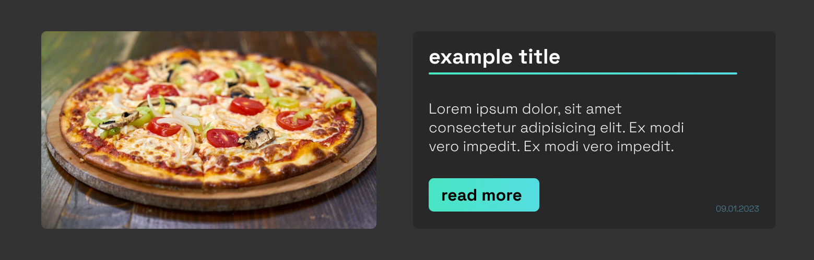
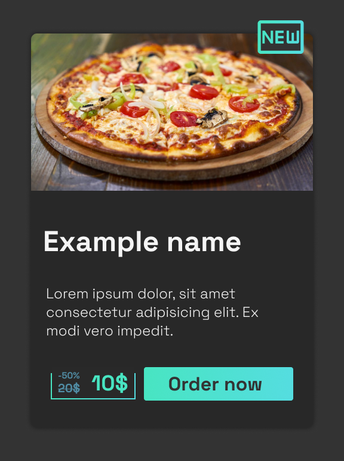
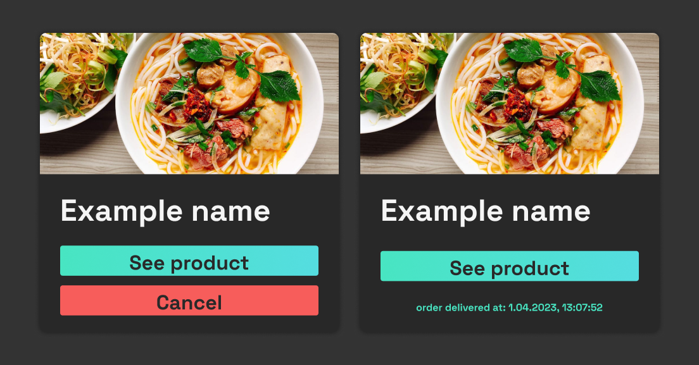

# Development docs

## table of contents

- [Installation](#installation)
- [Development preparation](#development-preparation)
  - [Adding .env files](#adding-env-files)
  - [Development server](#development-servers)
- [Components](#components)
- [Hooks](#hooks)

# Installation

## requirements

- [Supabase](https://supabase.com/) account
- JavaScript package manager like: [npm](https://nodejs.org/en)
- PHP package manager like: [composer](https://getcomposer.org/)
- [git](https://git-scm.com/)

Clone the repository

```bash
> git clone https://github.com/Liioan/Feastbits.git
```

### installing dependencies for client

```bash
> cd Feastbits/client
> npm install
```

### installing dependencies for server

```bash
> cd Feastbits/server
> composer install
```

# Development preparation

## adding .env files

You will need to create and fill .env files since they're ignored by git, and aren't present in this repository.

### client .env

Navigate to `/client` directory, copy `.env.example`, and rename it to `.env`.
After that edit credientials for your supabase client.

```env
VITE_API_BASE_URL=http://127.0.0.1:8000/api
VITE_SUPABASE_URL=
VITE_SUPABASE_KEY=
```

### server .env

Navigate to `/server` directory, copy `.env.example`, and rename it to `.env`.
After that edit credientials for your database.

```env
DB_CONNECTION=mysql
DB_HOST=127.0.0.1
DB_PORT=3306
DB_DATABASE=laravel
DB_USERNAME=root
DB_PASSWORD=
```

Also add your admin email adress

```env
ADMIN_EMAIL=example@example.dev
```

### database


To work with the project you'll need to perform migrations on database, to do so, open your terminal and run these commands:

```bash
> cd Feastbits/server
> php artisan migrate
```

You can also import showcase database, from included `showcase.sql` file.

> \*note there are two account registered in this database, admin@feastbits.dev and user@email.com. Both account have the same password, wich is `password`

## Development servers

To work with the project, you need to start development servers for both client and api.

To start client development server open your terminal and run these commands:

```bash
> cd Feastbits/client
> npm run dev
```

### client development server

To start api development server open another terminal and run these commands:

```bash
> cd Feastbits/server
> php artisan server
```

after this, open [http://localhost:5173/](http://localhost:5173/)

# Components

## component list

- [Buttons](#buttons)
  - [Gradient button](#gradient-button);
  - [Red button](#red-button)
  - [Delete button](#delete-button)
  - [Edit button](#edit-button)
  - [Complete button](#complete-button)
- [Lists](#lists)
  - [Blog list](#blog-list)
  - [Offer list](#offer-list)
  - [Order list](#order-list)
- [Cards](#cards)
  - [Blog card](#blog-card)
  - [Offer card](#offer-card)
  - [Order card](#order-card)
- [ErrorScreen](#error-screen)
- [Header](#header)
- [Price Tag](#price-tag)

## Buttons

## Gradient button


> this button should be used as a link to a subpage, so wrap it inside a `<Link>` component

### Syntax

```jsx
<GradientButton text={string} width={number} />
```

- use text prop to edit text inside button
- use width prop to declare max width of a button, e.g. 25 = 250 px

#

## Red button


> this button should be used for actions like logging out, or canceling subscription

### Syntax

```jsx
<RedButton text={string} width={number} onClickEvent={functionName} />
```

- use text prop to edit text inside button
- use width prop to declare max width of a button, e.g. 25 = 250 px
- use onClickEvent prop to pass down a function that will be executed on click

#

## Delete button


> this button should be used for deleting something like blog post

### Syntax

```jsx
<DeleteButton path={string} refresh={() => {}} />
```

- use the path prop to set path that deletes a specific item from database
- use refresh prop to refresh parent component after request (recomended: request from [useAxios hook](#useaxios))

#

## Edit button


> this button shoud be used as a button wich opens edit panel

### Syntax

```jsx
<EditButton setIsEditing={setState} setId={setState} id={number} />
```

- use setIsEditing, setId and id Syntax to set states in parent component

#

## Complete button


### Syntax

```jsx
<CompleteButton path={string} refresh={() => {}} />
```

- use the path prop to set path that edits a specific item from database
- use refresh prop to refresh parent component after request (recomended: request from [useAxios hook](#useaxios))

#

## Lists

## Blog list

> displays list of blog posts

### Syntax

```jsx
<BlogList isOnHomePage={boolean} path={string} />
```

- use the path prop to fetch data from route
- use the isOnHomePage prop to determine if [loading screen](#loading-screen) should be displayed while fetching data

#

## Offer list

> displays list of offers

### Syntax

```jsx
<OfferList isOnHomePage={boolean} path={string} />
```

- use the path prop to fetch data from route
- use the isOnHomePage prop to determine if [loading screen](#loading-screen) should be displayed while fetching data

#

## Order list

> displays list of orders user made

### Syntax

```jsx
<OfferList path={string} headerText={string} />
```

- use the path prop to fetch data from route (recomended: use different routes for different types of orders)
- use the headerText prop to set text inside of header displayed above the list

#

## Cards

#

## Blog card



### Syntax

```jsx
<BlogCard
  id={number}
  iteration={number}
  title={string}
  description={string}
  created_at={string}
  img_url={string}
  refresh={() => void}
/>
```

- use the id, title, description, created_at and img_url Syntax to display them
- use the iteration prop to delay animation of the component
- use refresh prop to refresh parent component after request (recomended: request from [useAxios hook](#useaxios))

#

## Offer card



### Syntax

```jsx
<OfferCard
  id={number}
  iteration={number}
  name={string}
  description={string}
  price={number}
  discount_price={number | null}
  created_at={string}
  img_url={string}
  type={string}
/>
```

- use the id, name, price, discount_price, type, description, and img_url Syntax to display them
- use the iteration prop to delay animation of the component
- use created_at to display 'new' badge
- use refresh prop to refresh parent component after request (recomended: request from [useAxios hook](#useaxios))

#

## Order card



### Syntax

```jsx
<OrderCard
  id={number}
  iteration={number}
  name={string}
  img_url={string}
  type={string}
  created_at={string}
  updated_at={string}
  is_completed={boolean}
  refresh={() => {}}
/>
```

- use the id, name, price, discount_price, type, description, and img_url Syntax to display them
- use the iteration prop to delay animation of the component
- use updated at, to display when order was delivered
- use refresh prop to refresh parent component after request (recomended: request from [useAxios hook](#useaxios))

#

## Error screen

### Syntax

```jsx
<ErrorScreen errorMessage={string} />
```

- use errorMessage prop to display error message

#

## Header

### Syntax


```jsx
<Header text={string} step={'h2' | 'h3'} />
```

- use text prop to set text displayed inside header
- use step prop to use different heading levels

#

## Price tag


### Syntax

```jsx
<PriceTag price={number} discount_price={number | null} />
```

- use price to display prop it
- use discount_price prop to display it

# Hooks

## useAxios

### Syntax

```jsx
const [loading, data, error, request] = useAxios<T>({axios config}, boolean)
```

- Generic type T indicates the data type returned from this hook
- Axios config object declares method, headers and data sent in request
- boolean indicates if hook will run when component mounts
- request function destructured from this hook is a function wich sends request again
