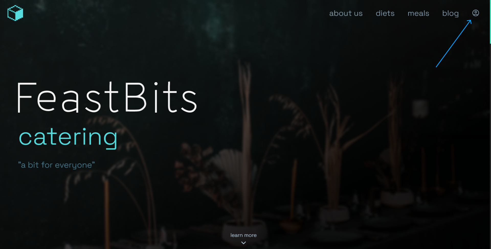
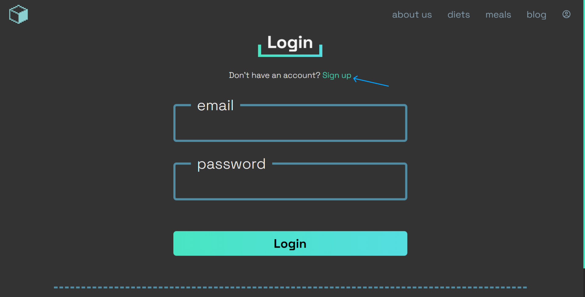
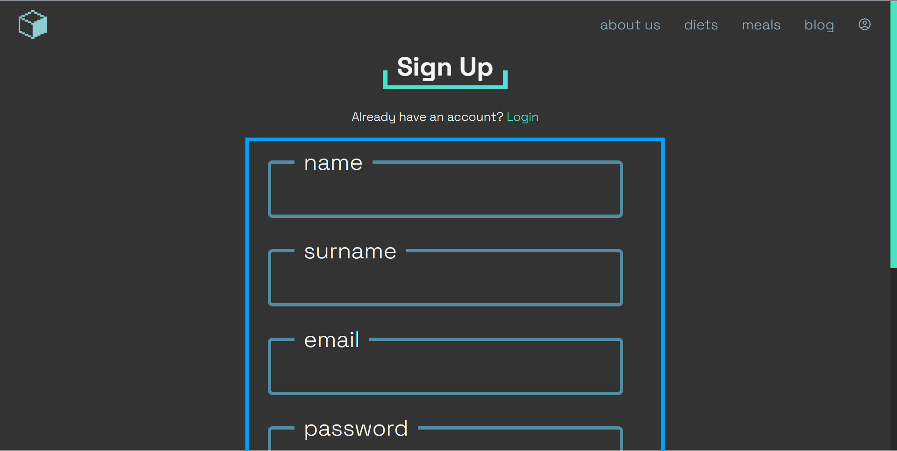

# User docs

## table of contents

- [registration](#registration)
- [ordering](#ordering)
- [canceling subscription](#canceling-subscription)

## Registration

To register a new account, press user icon in the top right corner

After that, click sign up button

Fill in the form marked with blue box, and press sign up button

## Ordering

To order, or subscribe click on either diests or meals button in top right

Then choose offer that you are interested in

Press subscribe button (or order now in case of meal)

Fill in form marked with blue box

Then press subscribe (or order now in case of meal)

## Canceling subscription

To cancel subscription press user icon in the top right corner

After that scroll down to subscription section, and press cancel button on the diet that you would like to cancel

